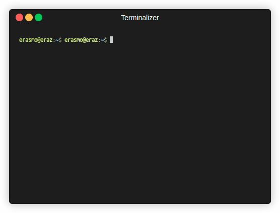

# std::cout << "Hello, World";

Hello. My name is Erasmo Alcazar, and I am currently a student at [Cal State Fullerton](http://www.fullerton.edu/). My major is Computer Science.

### CPSC 120

* Lab 10
    
    One of the most enjoyable computer science labs that I worked on was lab 10, Part 1 The reason that I liked the lab is because of the premise which was writing "a program that will create a two-dimensional data structure from `std::vector` to organize California's population data by county". In this lab, I was able to write a function that loops through a 2D vector and pulls out the name of each county.

    visual representaion:
    ```C++
    std::string AllCountiesString(const std::vector<std::vector<std::string>>& counties) {
      std::string all_counties_string;

      for (const auto& countie : counties) {
        all_counties_string += countie.at(0) + " ";
      }

      return all_counties_string;
    }
    ```

    

* Lab 12 

    Another lab that I found enjoyable was lab 12, Part 1. In Part 1 the objective was to create an animation by passing 10 images frame by frame in a loop to make it look as if it was in perpetual motion. In Part 1 ainimated_gradient_functions.cc we made a function called HasMatchingFileExtension() which identifies if they have the matching file extension.

    visual representaion:
    ```C++
    bool HasMatchingFileExtension(const std::string& file_name,
                                  const std::string& extension) {
      if (file_name.size() > extension.size() &&
          (file_name.compare(file_name.size() - extension.size(), extension.size(),
                            extension) == 0)) {
        return true;
      }
      return false;
    }
    ```

* Lab 9 

    In addition a lab that I liked was lab 9, part 1 which was a spell checker program. in the program we scanned a "document file" and looked for any word that had been mispelled. It uses the directory file to make sure which words are spelled correctly and incorrectley. The program keeps count of how many misplelled words were in the document file.

#### Computer Science Projects
Github page link: [https://github.com/Eraz-wq](https://github.com/Eraz-wq)